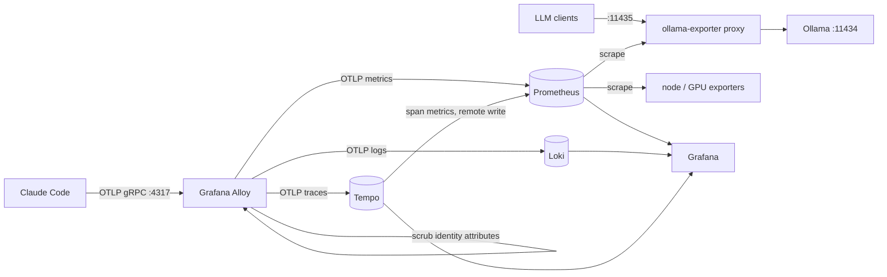

# agent-observability

Metrics, logs and traces for AI coding agents and a self-hosted LLM, on one box, with Prometheus at the centre.

Two sources feed it:

- **Claude Code**, through its built-in OpenTelemetry export: cost, tokens, cache use, tool calls, API errors, permission decisions and interaction traces.
- **Ollama**, through a small metering proxy that turns each inference call into Prometheus metrics named after the OpenTelemetry GenAI conventions: time to first token, decode speed, token counts, model load time, resident models and their VRAM split.

Everything runs from one `docker compose up`. Dashboards, rules and alerts live in the repo as code.



## Run it

```bash
cp .env.example .env        # set GRAFANA_ADMIN_PASSWORD
docker compose up -d --build
```

| Service | Port | Purpose |
|---|---|---|
| Grafana | 3000 | Dashboards in the "Agent Observability" folder |
| Prometheus | 9090 | Metrics, rules, alerts |
| Alloy | 4317 / 4318 / 12345 | OTLP gRPC / HTTP / pipeline UI |
| Loki | 3100 | Claude Code events |
| Tempo | 3200 | Claude Code traces |
| ollama-exporter | 11435 | Metering proxy in front of Ollama |

Point Claude Code at the stack:

```bash
OBS_HOST=your-host source client/claude-code.env
claude
```

Point LLM clients at `http://your-host:11435` instead of `:11434`. The proxy passes every request through unchanged.

**Transparent mode.** When many clients hardcode Ollama's port, move Ollama instead of the clients: set `OLLAMA_HOST=0.0.0.0:11436` on the Ollama service, then `OLLAMA_PROXY_PORT=11434` and `OLLAMA_UPSTREAM=http://host.docker.internal:11436` in `.env`. Every client is metered and none is edited. The proxy is then in the path of all inference; `restart: unless-stopped` brings it back after a crash, and `OllamaExporterDown` alerts if it stays down. `scripts/load.sh your-host` sends a mixed load so every panel has data.

The `node` and `nvidia-gpu` scrape jobs expect [node_exporter](https://github.com/prometheus/node_exporter) on :9100 and [nvidia_gpu_exporter](https://github.com/utkuozdemir/nvidia_gpu_exporter) on :9835 on the Docker host. Delete the jobs if the host has neither.

## Dashboards

**Local LLM (Ollama).** SLO stats, a time-to-first-token heatmap, p50/p95 by model, decode tokens per second, model load time, token throughput, resident models with their GPU/CPU split, GPU utilisation next to host CPU. The pairing answers the usual question for a small GPU: whether a slow model is slow because it spilled to CPU.

**Claude Code agents.** Spend by model, by source (main loop, subagent, auxiliary) and by skill or agent; tokens by type; the prompt-cache read share; tool calls by outcome and p95 duration from Loki events; API latency and errors; permission decisions; the slowest interactions from Tempo.

Dashboards are generated by `grafana/build.py` and provisioned read-only. Edit the Python, run it, commit the JSON.

## Design decisions

**Native OTLP into Prometheus.** Alloy pushes metrics to Prometheus's OTLP receiver (`--web.enable-otlp-receiver`) instead of converting to remote write. Only `service.name`, `service.version` and `host.name` are promoted to labels; the rest of the resource attributes stay on `target_info` and can be joined when needed. An out-of-order window of 30 minutes absorbs late OTLP batches.

**Cardinality.** Claude Code labels every metric with a session ID by default. Each new session then creates a fresh set of series that never receives another sample. `OTEL_METRICS_INCLUDE_SESSION_ID=false` keeps session IDs in events and traces, where per-session questions belong, and out of the TSDB.

**Identity out of storage.** Claude Code attaches the account email, account IDs and organisation ID to every signal. An Alloy attributes processor deletes them before any backend sees them. Prompt and response text stay at Claude Code's default: redacted.

**Cumulative temporality.** Prometheus stores cumulative counters. The client env sets `OTEL_EXPORTER_OTLP_METRICS_TEMPORALITY_PREFERENCE=cumulative`; Alloy's delta-to-cumulative processor is still experimental and stays off.

**A proxy for Ollama.** Ollama has no metrics endpoint, but its final response chunk carries `prompt_eval_count`, `eval_count`, `eval_duration` and `load_duration`. A pass-through proxy reads those without patching the server. Time to first token is recorded for streamed requests only; for a non-streamed response the first byte arrives with the last, and the number would be end-to-end latency under the wrong name.

**Burn-rate alerts with a traffic floor.** Availability (99%) and latency (95% of streamed chat requests see a first token within 4 s) use the multi-window, multi-burn-rate alerts from the Google SRE Workbook. A homelab LLM sees a handful of requests per hour, where one failure is a 100% error ratio, so each availability alert also requires a minimum request rate. `prometheus/tests/alerts_test.yml` checks both cases:

```bash
docker run --rm -v "$PWD/prometheus:/p:ro" -w /p/tests --entrypoint promtool \
  prom/prometheus:v3.5.0 test rules alerts_test.yml
```

**Span metrics.** Tempo's metrics generator writes RED metrics per span name back to Prometheus, so trace-derived latency can be graphed and alerted on next to everything else.

## Layout

```
alloy/config.alloy               OTLP receive, scrub, batch, fan out
prometheus/prometheus.yml        scrape jobs, OTLP settings
prometheus/rules/                recording rules, SLO burn-rate and symptom alerts
prometheus/tests/                promtool unit tests
loki/ tempo/                     single-binary configs, 90-day and 14-day retention
grafana/build.py                 dashboards as code
grafana/dashboards/              generated JSON, provisioned read-only
ollama-exporter/                 the metering proxy
client/claude-code.env           Claude Code telemetry settings
scripts/load.sh                  demo load
```

## License

MIT
