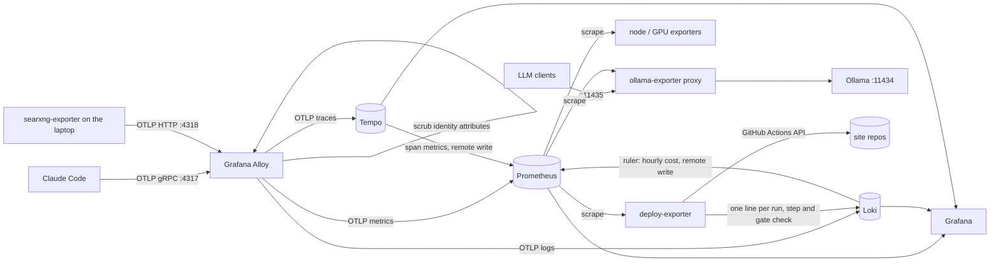

# agent-observability

Metrics, logs and traces for AI coding agents and a self-hosted LLM, on one box, with Prometheus at the centre.

Four sources feed it:

- **Claude Code**, through its built-in OpenTelemetry export: cost, tokens, cache use, tool calls, API errors, permission decisions and interaction traces.
- **Ollama**, through a small metering proxy that turns each inference call into Prometheus metrics named after the OpenTelemetry GenAI conventions: time to first token, decode speed, token counts, model load time, resident models and their VRAM split.

- **Website deploys**, through a small exporter that reads the GitHub Actions runs of three sites (machinebehavior.io, tychat.io, uncovertechtalent.com): every run, its steps, the conformity gate's verdict per check, and what the deploy shipped.
- **SearXNG**, the self-hosted search engine the agents search through, by an exporter on the laptop that runs it: whether it answers, searches per minute, latency, results per query, cache hits, each engine's rate limits and blocks, and whether its proxy egress exits from the right IP.

Everything runs from one `docker compose up`. Dashboards, rules and alerts live in the repo as code.



## Run it

```bash
cp .env.example .env        # set GRAFANA_ADMIN_PASSWORD
docker compose up -d --build
```

| Service | Port | Purpose |
|---|---|---|
| Grafana | 3000 | Dashboards in the "Agent Observability" folder |
| Prometheus | 9090 | Metrics, rules, alerts |
| Alloy | 4317 / 4318 / 12345 | OTLP gRPC / HTTP / pipeline UI |
| Loki | 3100 | Claude Code events |
| Tempo | 3200 | Claude Code traces |
| ollama-exporter | 11435 | Metering proxy in front of Ollama |
| deploy-exporter | 9201 | Website deploy runs to Loki, latest state as metrics |

Point Claude Code at the stack:

```bash
OBS_HOST=your-host source client/claude-code.env
claude
```

Ship SearXNG's health from the machine that runs it (macOS; Python 3.9+, standard library only):

```bash
mkdir -p ~/.config/searxng-exporter
echo "SEARXNG_METRICS_PASSWORD=<general.open_metrics from settings.yml>" > ~/.config/searxng-exporter/env
sed -e "s#__REPO__#$PWD#; s#__OBS_HOST__#your-host#; s#__HOME__#$HOME#g" \
    -e "s#__PROXY_URL__##; s#__PROXY_EXIT_IP__##" client/searxng-exporter.plist \
    > ~/Library/LaunchAgents/searxng-exporter.plist
launchctl bootstrap gui/$(id -u) ~/Library/LaunchAgents/searxng-exporter.plist
```

Set the proxy URL and its expected exit IP if some engines use a proxy; leave them empty otherwise.

Point LLM clients at `http://your-host:11435` instead of `:11434`. The proxy passes every request through unchanged.

**Transparent mode.** When many clients hardcode Ollama's port, move Ollama instead of the clients: set `OLLAMA_HOST=0.0.0.0:11436` on the Ollama service, then `OLLAMA_PROXY_PORT=11434` and `OLLAMA_UPSTREAM=http://host.docker.internal:11436` in `.env`. Every client is metered and none is edited. The proxy is then in the path of all inference; `restart: unless-stopped` brings it back after a crash, and `OllamaExporterDown` alerts if it stays down. `scripts/load.sh your-host` sends a mixed load so every panel has data.

The `node` and `nvidia-gpu` scrape jobs expect [node_exporter](https://github.com/prometheus/node_exporter) on :9100 and [nvidia_gpu_exporter](https://github.com/utkuozdemir/nvidia_gpu_exporter) on :9835 on the Docker host. Delete the jobs if the host has neither.

## Dashboards

**Local LLM (Ollama).** SLO stats, a time-to-first-token heatmap, p50/p95 by model, decode tokens per second, model load time, token throughput, resident models with their GPU/CPU split, GPU utilisation next to host CPU. The pairing answers the usual question for a small GPU: whether a slow model is slow because it spilled to CPU.

**Claude Code agents.** Spend by model, by source (main loop, subagent, auxiliary) and by skill or agent; tokens by type; the prompt-cache read share; requests, prompts and tool calls. All of these are sums over Claude Code's events in Loki, one per API call. Then tool calls by outcome and p95 duration, API latency and errors, permission decisions, and the slowest interactions from Tempo.

**Website deploys.** Which site deployed and how long ago, deploy runs per hour by outcome (deployed, blocked by the gate, failed, cancelled), wall time from push to live, where the time goes per workflow step, the gate's result for every check on every run, what the deploy shipped (map snapshot size, links carried forward from unreachable pages) and the decision-probe fold rates the site reports. Deploy markers sit on the duration chart. The dashboard has no template variables and the exporter keeps titles, SHAs and URLs of private repos out of Loki, so it is shared as it is.

Dashboards are generated by `grafana/build.py` and provisioned read-only. Edit the Python, run it, commit the JSON.

**SearXNG (house search).** Whether the instance and its proxy egress answer, searches per minute by outcome (results, empty, degraded), latency p50/p95 of upstream calls next to the time spent queued for the pacing lock, results per query, cache hits, each engine's latest state on a timeline (ok, empty, rate-limited, blocked, timeout), failed calls by engine and reason, results contributed per engine, SearXNG's own upstream request count per engine, and its error share by error class. Internal only.

## Design decisions

**Native OTLP into Prometheus.** Alloy pushes metrics to Prometheus's OTLP receiver (`--web.enable-otlp-receiver`) instead of converting to remote write. Only `service.name`, `service.version` and `host.name` are promoted to labels; the rest of the resource attributes stay on `target_info` and can be joined when needed. An out-of-order window of 30 minutes absorbs late OTLP batches.

**Cost and tokens from per-request events.** Claude Code exports cumulative counters with no per-process attribute: it sets no `service.instance.id`, and `OTEL_METRICS_INCLUDE_SESSION_ID=false` drops the session ID. The desktop app runs several Claude Code processes at once (up to about 12 in the week to 2026-10-09), and all of them write the same Prometheus series. Each interleaved export reads as a counter reset. In that week `resets()` counted 230,328 and `increase()` reported USD 1.97M, while the API calls themselves cost USD 76 in the last 24 hours of it. Prometheus also rejected 235 batches that carried two values for one timestamp.

A per-process label would stop the resets for about 600 extra series a day, some 54,000 at 90-day retention. It would not make the counters exact. Each process's series starts at its first non-zero value, and Prometheus 3.5 does not turn the OTLP start time into a zero sample (tested with `created-timestamp-zero-ingestion`), so `increase()` would lose each process's first export and count a process that exports once as zero.

Claude Code also writes one `api_request` event per API call with its cost and four token counts. Summed in Loki, the events match the local session transcripts within 0.1% for the main model over a week, include side calls the transcripts leave out (prompt suggestions, compaction, web fetch), and are correct back to the first event. The dashboards and the spend alert read the events. Loki's ruler records the hourly cost and writes it to Prometheus for the alert. The counters still arrive in Prometheus; nothing sums them.

**Identity out of storage.** Claude Code attaches the account email, account IDs and organisation ID to every signal. An Alloy attributes processor deletes them before any backend sees them. Prompt and response text stay at Claude Code's default: redacted.

**Cumulative temporality.** Prometheus stores cumulative counters. The client env sets `OTEL_EXPORTER_OTLP_METRICS_TEMPORALITY_PREFERENCE=cumulative`; Alloy's delta-to-cumulative processor is still experimental and stays off.

**A proxy for Ollama.** Ollama has no metrics endpoint, but its final response chunk carries `prompt_eval_count`, `eval_count`, `eval_duration` and `load_duration`. A pass-through proxy reads those without patching the server. Time to first token is recorded for streamed requests only; for a non-streamed response the first byte arrives with the last, and the number would be end-to-end latency under the wrong name.

**SearXNG pushed from a laptop.** The instance runs on a laptop that sleeps and changes address, so its exporter pushes OTLP to Alloy instead of waiting for a scrape. Sleep shows as a gap. The alerts read pushed values, or failure ratios with a minimum number of calls; none reads `up` or `absent()`, which would fire every night. SearXNG's own `/metrics` gives lifetime medians and no suspension state, so per-search data comes from the search wrapper: it writes one JSON line per call (outcome, cache hit, latency, results, the engines that failed and why, no query text) and the exporter turns those lines into counters and histograms. The exporter starts every counter it alerts on at zero, so `increase()` also counts the first failure after a restart.

**Burn-rate alerts with a traffic floor.** Availability (99%) and latency (95% of streamed chat requests see a first token within 4 s) use the multi-window, multi-burn-rate alerts from the Google SRE Workbook. A homelab LLM sees a handful of requests per hour, where one failure is a 100% error ratio, so each availability alert also requires a minimum request rate. `prometheus/tests/alerts_test.yml` checks both cases:

```bash
docker run --rm -v "$PWD/prometheus:/p:ro" -w /p/tests --entrypoint promtool \
  prom/prometheus:v3.5.0 test rules alerts_test.yml
```

**Span metrics.** Tempo's metrics generator writes RED metrics per span name back to Prometheus, so trace-derived latency can be graphed and alerted on next to everything else.

**Deploys read from the outside.** The exporter polls the GitHub Actions API and the sites' public JSON instead of pushing from inside the workflows. The site repos stay unchanged, no ingest endpoint is exposed, and a run that dies before any step can report is still recorded, as is a run the gate blocks. History goes to Loki at the time each run finished, so a fresh exporter backfills the last week (Loki's limit for old samples) and Grafana draws it at once; replayed lines are exact duplicates and Loki drops them. Job logs expire on GitHub after a while; older runs keep their timings but lose the per-check verdict.

## Layout

```
alloy/config.alloy               OTLP receive, scrub, batch, fan out
prometheus/prometheus.yml        scrape jobs, OTLP settings
prometheus/rules/                recording rules, SLO burn-rate and symptom alerts
prometheus/tests/                promtool unit tests
loki/ tempo/                     single-binary configs, 90-day and 14-day retention
loki/rules/                      Loki ruler: Claude Code hourly cost for the spend alert
grafana/build.py                 dashboards as code
grafana/dashboards/              generated JSON, provisioned read-only
ollama-exporter/                 the metering proxy
deploy-exporter/                 website deploy runs from GitHub Actions
client/claude-code.env           Claude Code telemetry settings
client/searxng_exporter.py       SearXNG health, pushed as OTLP from the machine that runs it
client/searxng-exporter.plist    launchd agent for it (macOS)
scripts/load.sh                  demo load
```

## License

MIT
